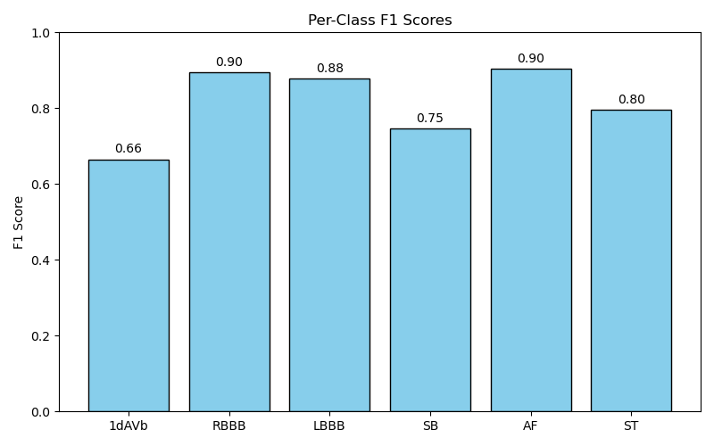

# Automatic ECG Diagnosis with PyTorch

A PyTorch reimplementation of the deep residual neural network for **12-lead ECG classification**.  
Trained and evaluated on the open **CODE-15% dataset** (~345k exams, 12 leads, 400Hz, 10s signals).

---

## 📊 Results (Shard 0: ~20k exams)

- **Macro AUROC:** 0.996  
- **Macro AUPRC:** 0.84  
- **Macro F1:** 0.81  

Per-class F1 scores:



---

## 🚀 Quick Start

### 1. Install
```bash
pip install -r requirements.txt
````

### 2. Prepare data

Download [CODE-15% dataset](https://doi.org/10.5281/zenodo.4916206).
Filter to a shard (e.g., `exams_part0.hdf5`) and build an index:

```bash
python tools/prepare_code15_index.py \
  --exams_csv data/code15/exams_part0.csv \
  --h5_dir data/code15 \
  --out_index_csv data/code15/exams_part0_index.csv
```

### 3. Train

```bash
python -m ecg.train --config configs/base.yaml device=mps train.amp=false train.num_workers=0
```

### 4. Select thresholds

```bash
python -m ecg.select_thresholds --config configs/base.yaml ckpt=checkpoints/best.ckpt device=mps
```

### 5. Predict

```bash
python -m ecg.predict --config configs/base.yaml \
  --ckpt checkpoints/best.ckpt \
  --out.npy outputs/preds.npy \
  --thresholds_json outputs/thresholds.json device=mps
```

### 6. Evaluate

```bash
python -m ecg.evaluate --config configs/base.yaml \
  --csv data/code15/exams_part0.csv \
  --preds outputs/preds.npy \
  --labels outputs/preds_labels.npy
```

---

## 🧠 Model

* **Input:** (N, 12, 4096) ECG traces (12 leads, 10s @ 400Hz)
* **Architecture:** Residual 1D CNN (ResNet-style)
* **Output:** 6 binary abnormality predictions (multi-label)

  * 1dAVb, RBBB, LBBB, SB, AF, ST

---

## 📂 Repo Structure

```
ecg_project/
├── ecg/               # training, prediction, evaluation code
│   ├── train.py
│   ├── predict.py
│   ├── select_thresholds.py
│   ├── evaluate.py
│   ├── visualize.py
│   ├── data/
│   │   ├── __init__.py
│   │   ├── hdf5_dataset.py
│   │   └── sharded_hdf5_dataset.py
│   ├── models/
│   │   └── resnet1d.py
│   └── utils/
│       ├── common.py
│       ├── filterExams.py
│       ├── metrics.py
│       └── sanity_check_results.py
├── configs/           
├── tools/             # data preparation utilities
├── data/   
│   └── code15         # raw dataset code15 dir goes here (not added to github)
└── outputs/           # predictions, thresholds, figures
```

---

## 📖 References

* Ribeiro et al., *Automatic diagnosis of the 12-lead ECG using a deep neural network*, **Nature Comms, 2020**.
* CODE dataset: [Zenodo link](https://doi.org/10.5281/zenodo.4916206).

---
