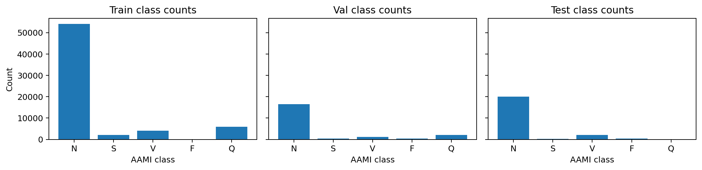
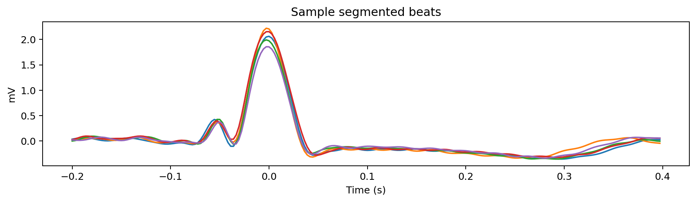
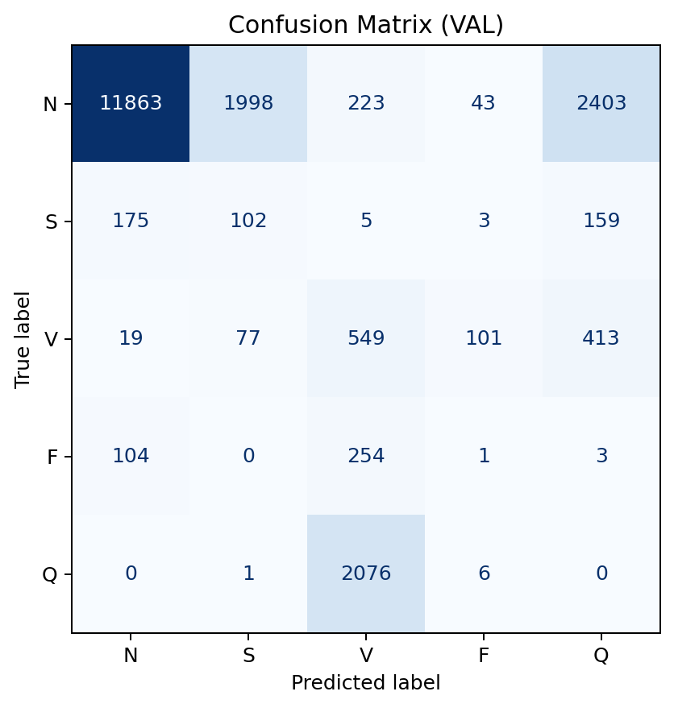
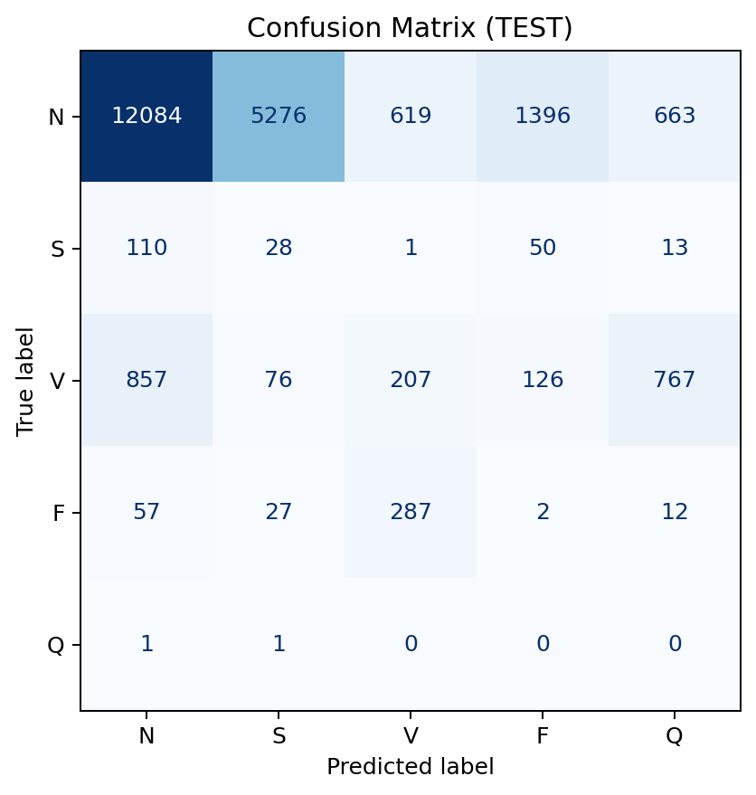
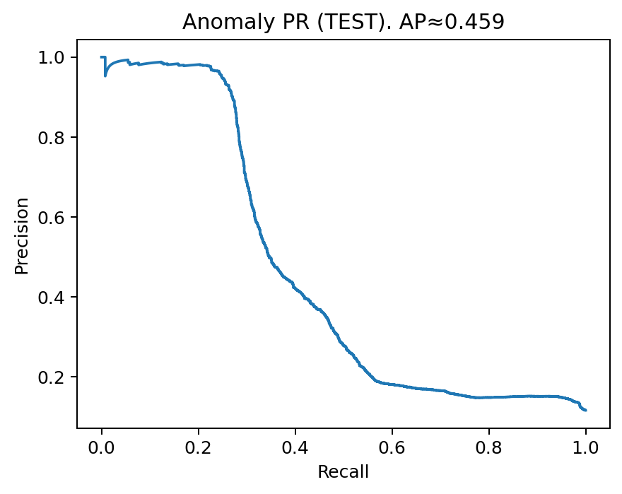
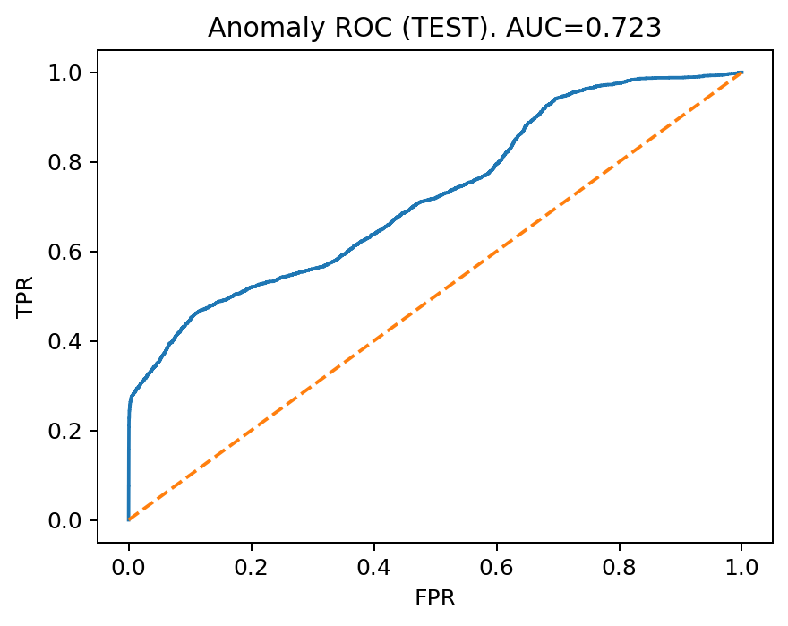

# ECG Signal Analysis

Modular Python workflows for **ECG anomaly detection and arrhythmia classification**.
Designed with **object-oriented components** for preprocessing, feature extraction, and modeling.
Built and tested on the **MIT-BIH Arrhythmia Database** using AAMI 5-class labels.

---

## ✨ Features

* **Preprocessing**: bandpass filtering, resampling, baseline correction
* **Beat segmentation**: annotation-centered R-peak windows (200 ms pre, 400 ms post)
* **Feature extraction**: morphology-based features (peak, trough, energy, width, total variation)
* **Anomaly detection**: unsupervised workflow (Isolation Forest trained on normal beats)
* **Classification**: supervised workflow (logistic regression baseline, sklearn pipeline)
* **Extensible design**: modular `Preprocessor`, `BeatSegmenter`, `FeatureExtractor`, and `Model` classes

---

## ⚙️ Installation

```bash
git clone https://github.com/uday1o1/ecg-signal-analysis.git
cd ecg-signal-analysis
python3 -m venv .venv
source .venv/bin/activate   # Windows: .venv\Scripts\activate
pip install -r requirements.txt
```

---

## 🚀 Usage

1. **Download MIT-BIH dataset**

```bash
python -c "import wfdb; wfdb.dl_database('mitdb', dl_dir='data/mitdb')"
```

2. **Build train/val/test splits**

```bash
python scripts/build_beats_mitbih.py
```

3. **Train anomaly detector**

```bash
python scripts/train_anomaly.py
```

4. **Train arrhythmia classifier**

```bash
python scripts/train_classify.py
```

5. **Generate README figures**

```bash
python scripts/make_readme_figs.py
```

---

## 📊 Visuals

**Class distribution (train/val/test)**


**Sample segmented beats**


**Confusion Matrix — Validation**


**Confusion Matrix — Test**


**Anomaly Detection — Precision–Recall (Test)**


**Anomaly Detection — ROC (Test)**


---

## 📈 Example Baseline Results

* **Anomaly detection (Isolation Forest on normal beats)**

  * AUROC ≈ 0.72–0.76
  * AUPRC ≈ 0.45–0.47

* **Classification (Logistic Regression on morphology features)**

  * Accuracy ≈ 0.66
  * Macro-F1 ≈ 0.23–0.25
  * Good performance on class **N** (normal), weaker on rare arrhythmia classes (expected with imbalance & simple features).

---

## 🤝 Contributing

PRs welcome!
Ideas: add LightGBM/XGBoost classifiers, richer features (RR intervals, HRV, wavelets), or a simple 1D-CNN.

---

## ⚠️ Disclaimer

This repository is for **research and educational purposes only**.
It is **not a certified medical device** and must not be used for clinical decision making.

---